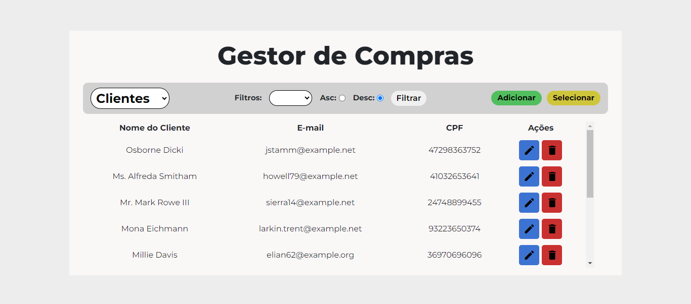
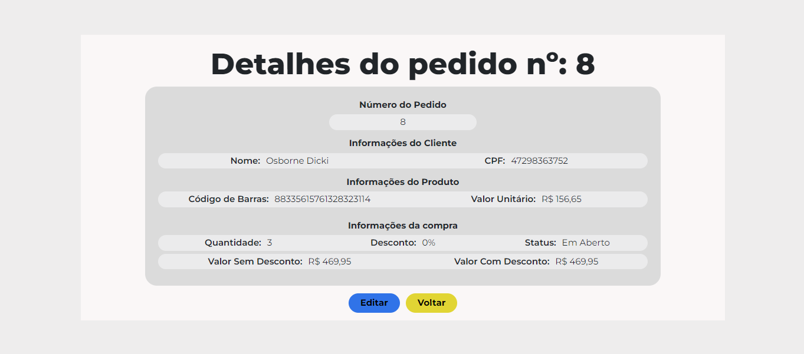
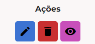

# Aplicação Web para gestão de clientes, produtos e pedidos

## ❕ Informações sobre a aplicação:

- A aplicação possibilita a realização das 4 operações básicas de CRUD, create (criar), read (ler), update (atualizar) e delete (excluir), nos três modelos principais da aplicação: Clients, Products e Purchases.

- A aplicação oferece uma interface amigável, intuitiva e de fácil utilização.



- A filtragem de informações pode ser feita através da visualização das categorias em ordem crescente ou decrescente.


- Em Purchases, é possível ter uma visualização completa do pedido, incluindo informações do comprador, do produto, valores e status do pedido.



- É possivel realizar a edição e a remoção de qualquer item, de qualquer tabela. E no caso de Purchases, é possível visualizar as informações.



## 📚 Recursos necessários

Para iniciar a aplicação é necessario antes instalar e conferir os seguintes itens:

-   [PHP ](https://www.php.net/downloads.php)
-   [Composer](https://getcomposer.org)
-   [ Laravel / Artisan](https://laravel.com/docs/10.x)

#### Realize a instalação das dependências via Composer:

```sh
composer install
```
#### Faça uma cópia do conteúdo de .env.example para um arquivo novo .env

```sh
copy .env.example .env
```
#### Gere a Chave de Criptografia

```sh
php artisan key:generate
```

Altere as variaveis de ambiente em .env de acordo com as propiedades do seu banco de dados

```properties
DB_DATABASE= <database>
DB_USERNAME = <usuario>
DB_PASSWORD = <senha>
```

## ✈ Como rodar?

#### Inicie as migrations para configuração do banco:

```sh
php artisan migrate
```

#### Inicie os seeders para alimentar o banco com dados iniciais:

```sh
php artisan db:seed
```

#### Agora, inicie o servidor local (por padrão, é iniciado na porta 8000):

```sh
php artisan serve
```

## 💻 Endpoints da aplicação:

### Pagina inicial

- Por padrão, o comando artisan serve roda a aplicação no seguinte endereço, mas pode ser alterado.

Pagina inicial de Boas Vindas.
```
http://127.0.0.1:8000/
```

Paginas de consulta.
```
GET
http://127.0.0.1:8000/clients

http://127.0.0.1:8000/products

http://127.0.0.1:8000/orders
```

Paginas de cadastro.
```
GET
http://127.0.0.1:8000/clients/create

http://127.0.0.1:8000/products/create

http://127.0.0.1:8000/orders/create
```

Paginas de atualização.
```
GET
http://127.0.0.1:8000/clients/{client}/edit

http://127.0.0.1:8000/products/{product}/edit

http://127.0.0.1:8000/orders/{purchase}/edit
```

Paginas de deleção.
As páginas de deleção estão já configuradas na tela inicial ao clicar no botão de remoção.

-⚠ Todos endpoints podem ser conferidos através do comando:

```sh
php artisan route:list
```

## 🤩 Implementações adicionais:

### Aplicar descontos em produtos;

- É possivel aplicar desconto a um determinado produto diretamente em sua criação (que por padrão, é de 0%).

## ❤ Muito obrigado! 

- Muito obrigado por ler até aqui!

- Qualquer duvida, sugestão ou comentario sinta-se livre para entrar em contato:
    - spedrobreno.2012@hotmail.com
    - [Meu perfil no LinkedIn](www.linkedin.com/in/pp-oliveira)
